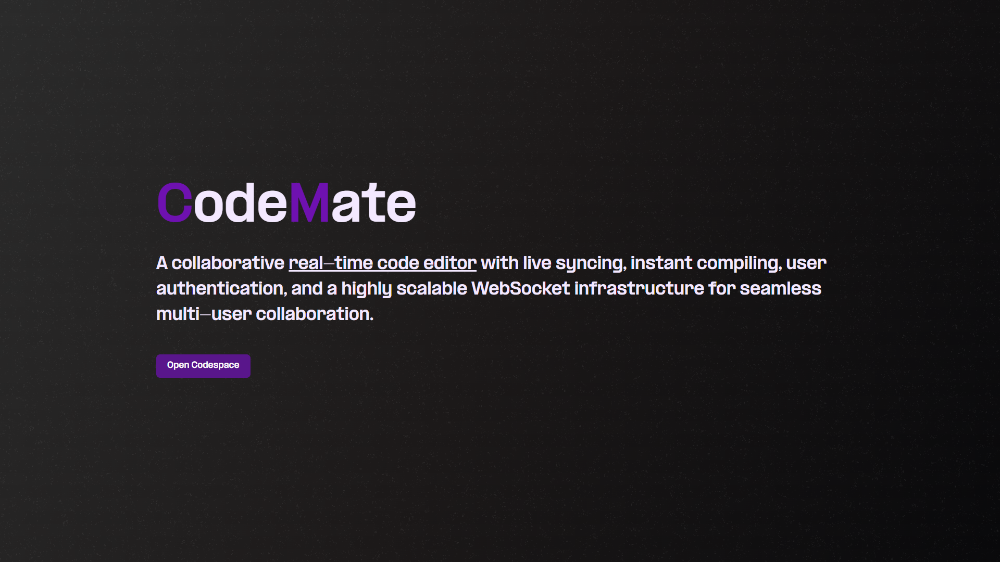

# CodeMate

Codemate is a real-time collaborative code editor with live syncing, instant compiling, user authentication, and a highly scalable WebSocket infrastructure for seamless multi-user collaboration.

## Live demo & screenshots

[Live Demo](https://codemate.v8coder.com)

Login using the following provided user credentials:

> Email: testuser@example.com, Password: 123456




## 💻 Tech stack

**Monorepo:** Created using turborepo  
**Frontend:** React, TailwindCSS, Monaco Editor, Shadcn UI  
**Backend:** Node.js, Express, Redis
**Real-time:** WebSockets (Socket.io or native), Redis Pub/Sub  
**Database:** PostgreSQL (via Prisma)  
**Deployed on:** AWS EC2

## 😎 Features

- Stateless authentication using JWT
- Online codespace with output and input pannels
- Multi-language support online compiler to run and compile code snippets
- Realtime sharing of codespace with option to allow others to also edit

## 🤖 Installation

Step by step guide to run it locally.

```sh
# 1.Clone the repository
git clone https://github.com/Ashutosh6393/CodeMate.git

# 2.Go into project directory
cd codemate

# 3.Install packages
pnpm install

# 4.Copy create .env
./copy-env.sh

# 5.Manually add the mentioned environment variables in .env

# 6.Start dev server
turbo dev

```

## 🛠️ Configuration / Environment Variables

```sh
# ./apps/client/.env
VITE_SERVER_URL=http://localhost:3000/api/v1
VITE_SOCKET_URL=ws://localhost:8080

# ./apps/server/.env
JWT_ACCESS_TOKEN_SECRET=youraccesssecret
JWT_REFRESH_TOKEN_SECRET=yourrefreshsecret
JUDGE0_API_KEY=

# ./apps/socketServer/.env
REDIS_USERNAME=
REDIS_PASSWORD=
REDIS_HOST=
REDIS_PORT=

# ./packages/database
DATABASE_URL=
```

## Apps and packages

- React Frontend : `apps/client`  
- NodeJS Backend :` apps/server`  
- Socket Server : `apps/sockeServer`
- Database : `packages/database`

## Usage

Access the application in your browser:

```
http://localhost:5173
```

## Useful Links

Learn more about the power of Turborepo:

- [Turborepo](https://turborepo.com/)
- [Judge0](https://judge0.com/)

This project is licensed under the MIT License.
